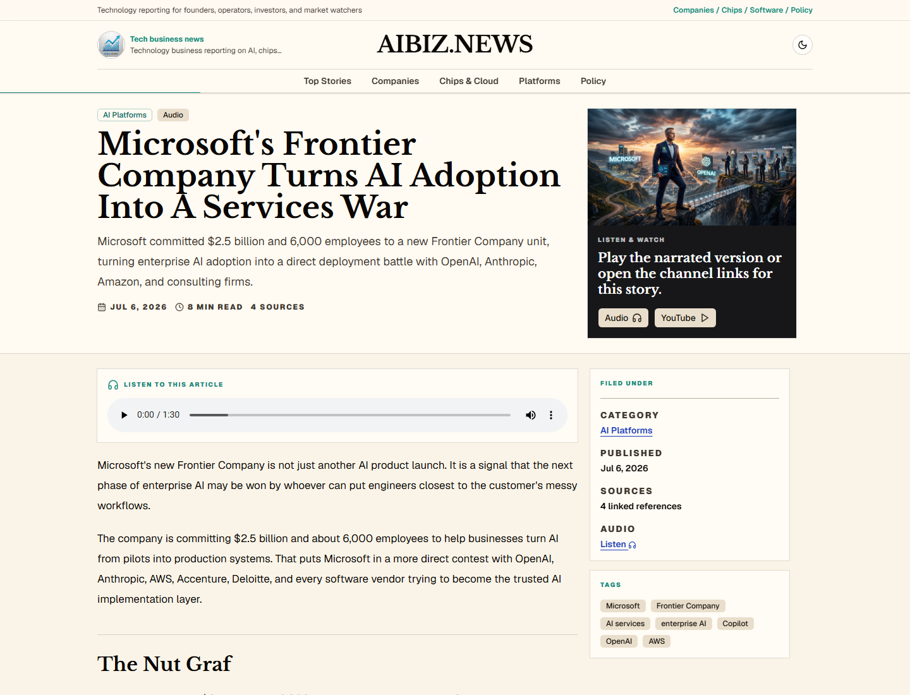
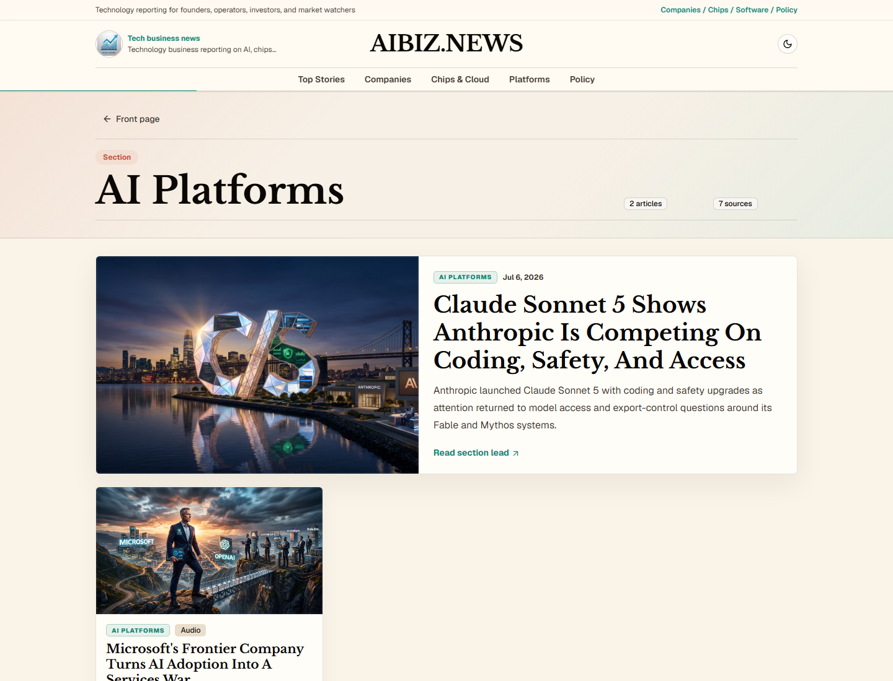

# AIBIZ.NEWS

<p align="center">
  
</p>

**Technology business news for founders, operators, investors, and market watchers: AI, chips, software, security, consumer products, markets, and policy in one source-backed newsroom.**

AIBIZ.NEWS is a Markdown-powered editorial site for technology business reporting. It publishes source-backed articles with categories, cover images, audio narration, newsletter capture, and links to related YouTube Shorts and TikTok news videos.

Live site: **[aibiznews-website.vercel.app](https://aibiznews-website.vercel.app)**

<p align="center">
  
</p>

---

## Demo

| Article page | Category page |
|---|---|
|  |  |

The homepage is built for a news layout: lead story, fresh reads, category navigation, article cards, audio links, and newsletter signup. Each article has its own metadata, social preview image, source footer, audio player, and channel links when video is available.

---

## What This Repo Contains

- A Next.js App Router news website.
- Markdown articles in `content/articles/*.md`.
- Landscape article cover images in `public/images/covers/`.
- Audio narration in `public/audio/`.
- A newsletter signup API backed by Postgres.
- Admin and analytics pages for reviewing newsletter signups and traffic.
- Vercel Analytics integration.

## Content Model

Each article uses frontmatter for:

- title, slug, date, category, description
- cover image and social metadata
- tags and source count
- audio URL
- YouTube and TikTok links
- publication/video status

Articles are stored as Markdown so the automation pipeline can write directly into the same public repo that deploys the site.

## Development

```bash
npm install
npm run dev
```

Production build:

```bash
npm run build
```

## Cover Generation

Pixio cover generation is available through the existing scripts and targets Nano Banana 2 by default:

```bash
npm run covers:pixio
npm run covers:pixio:force
```

Set `PIXIO_API_KEY` locally before running cover generation.

## Newsletter

Set one of these environment variables before deploying newsletter signups:

```text
DATABASE_URL
POSTGRES_URL
POSTGRES_PRISMA_URL
```

The app writes signups to the `newsletter_subscribers` table. The schema is available at `db/schema.sql`.

## Vercel

Import this repository in Vercel and use the default Next.js settings:

- Build command: `npm run build`
- Output: managed by Next.js

Current verified production URL:

```text
https://aibiznews-website.vercel.app
```

Use that URL for platform metadata until `https://aibiznews.com` is confirmed to serve this same Vercel deployment.
